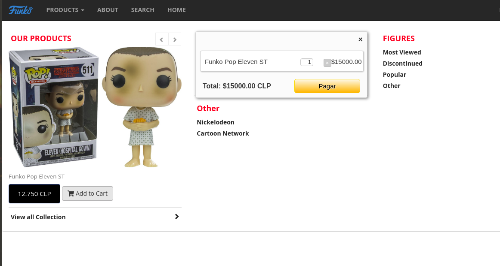

# Proyecto final 6
## Proyecto desarrollo app e-commerce

* Como reto final de este curso deberás crear una app web bajo los principios de SPA Single page aplication.

## Vanilla SPA

- Creando un SPA simple
- para mas información

[Vanilla script SPA]

# Apis Y librerias
- Mercado libre api base de datos
- Plataforma pago on line paypal libreria minicart

## Metodología de trabajo

* Slack fue utilizado para mantener la comunicación entre el equipo.
* Se utilizó el método SCRUM para mantener una buena organización y mejorar los tiempos de entrega del producto.

## Acerca del producto:

* Nuestra APP web consiste en la compra online de figuras de colección correspondientes a la marca Funko Pop, por medio del pago vía Paypal.

* Visualización, categorización y detalles, por medio de slider funcional junto con el "add to cart" que nos permite agregar nuestra compra al carrito.

:smile: [Helen Harnish](https://github.com/HelenHarnish)
:smile: [Daniela Parraguez](https://github.com/daniparraguez)
:smile: [Carolina Saavedra](https://github.com/saahub)
:smile: [Lorena Palominos](https://github.com/lpalominosf)

